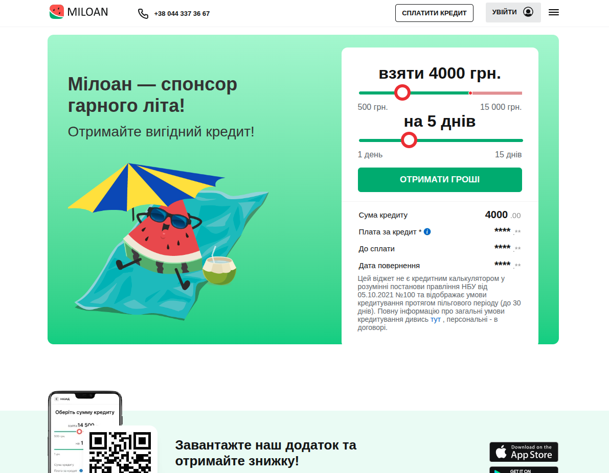

# MILOAN SITE

A website created only to improve my Pug+Sass+JS skills.

## Description
This project was made to revisit the basics of Pug+Sass+JSl.
The site is for Miloan, a micro-credit company.

## Screenshots

## Technologies Used
- Pug
- Sass
- JS

## How to Run

Visit the site here: <a href="https://taras-bilyk.github.io/miloan_by_bilyk_taras/">https://taras-bilyk.github.io/miloan_by_bilyk_taras//</a>

## Project Structure
- `docs/` — simple HTML version
- `src/` — Pug + Sass version

## Project Goal
To practice web development fundamentals, layout structure, and repository setup.

---

